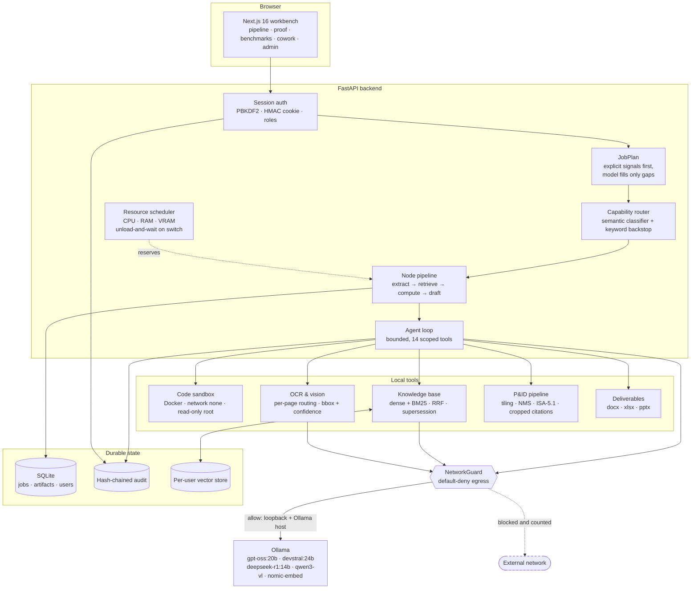
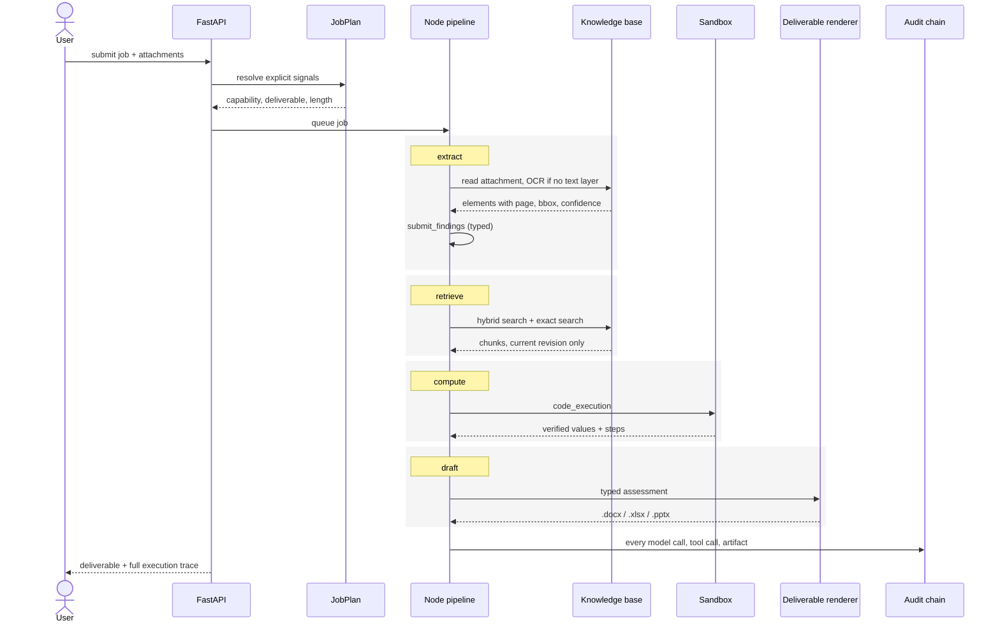
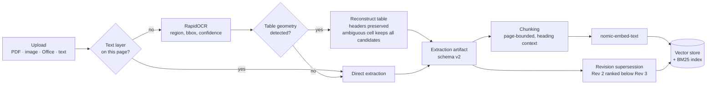

# AstraSovereign — On-Premise Sovereign AI Workbench

An air-gapped, agentic AI workbench for confidential industrial work. It reads scanned inspection reports and engineering drawings, grounds its answers in your own procedures, verifies its arithmetic in a sealed container, and hands back a Word approval note, an Excel workbook or a PowerPoint deck — on one GPU server, with no route to the internet.

Built for **Smart India Hackathon 2026, Problem Statement 26117** (Mangalore Refinery and Petrochemicals Limited).

**Status:** 211 commits · 829 backend tests · 81 frontend tests · 5 local models · 14 agent tools · 0 bytes of egress

---

## Table of contents

- [Why this exists](#why-this-exists)
- [Hard constraints](#hard-constraints)
- [Architecture](#architecture)
- [Capabilities](#capabilities)
  - [Multi-model routing](#multi-model-routing)
  - [Document intelligence](#document-intelligence)
  - [P&ID understanding](#pid-understanding)
  - [Agent tools](#agent-tools)
  - [Deliverables](#deliverables)
  - [Code sandbox](#code-sandbox)
- [Pages](#pages)
- [Repository layout](#repository-layout)
- [Getting started](#getting-started)
- [Configuration](#configuration)
- [Testing and evaluation](#testing-and-evaluation)
- [Verifying the sovereignty claim](#verifying-the-sovereignty-claim)
- [Security](#security)
- [Known limitations](#known-limitations)
- [Documentation](#documentation)
- [Contributing](#contributing)
- [Credits](#credits)
- [License](#license)

---

## Why this exists

Refineries, PSUs and defence-linked units generate a constant stream of routine knowledge work on confidential material — P&IDs, inspection reports, vendor negotiations, unreleased designs, internal correspondence. Policy keeps it on site, so people either do the work by hand or quietly paste it into a public tool anyway.

Samsung banned ChatGPT outright after employees leaked internal source code into it. India's Finance Ministry issued the same advisory to its own staff. Open-weight reasoning models are now good enough to do this work locally, but nothing deployable existed that an industrial user could actually work in.

This is the third option: the data does not leave, and the work still gets done.

---

## Hard constraints

These are enforced in code, not stated on a slide.

| Constraint | Mechanism |
|---|---|
| No external network at runtime | `NetworkGuard` — default-deny transport, allowing loopback and the configured Ollama host only. A blocked attempt raises `ExternalNetworkBlocked` and is counted. |
| No model lock-in | Every capability resolves through `config/models.yaml`. No model name is hardcoded anywhere in the backend. |
| Numbers are computed, never asserted | Any numeric finding must be verified by a real `code_execution` run before it can reach a deliverable. |
| Nothing is silently guessed | Ambiguous OCR cells keep every candidate; low-confidence extractions are referred to a human. |
| Everything is recorded | Append-only, hash-chained audit trail with a verification endpoint. |
| Document text is data, never instruction | Nonce-keyed untrusted-content framing on every document-derived tool result. |

---

## Architecture



**Stack.** FastAPI, Uvicorn and Pydantic Settings on Python 3.12; Next.js 16 with React, TypeScript and Tailwind CSS v4; SQLite for jobs, artifacts, users and audit; Ollama for local model serving; Docker for the sandbox; a vendored offline PptxGenJS component for PowerPoint rendering.

---

## Capabilities

### Multi-model routing

Five local models, one per capability, declared in `config/models.yaml` together with their VRAM footprint. Adding a model is a configuration entry, not a redesign.

| Capability | Model | Role |
|---|---|---|
| `general` | `gpt-oss:20b` | reasoning and drafting |
| `coding` | `devstral:24b` | writes and runs code |
| `math` | `deepseek-r1:14b` | checks arithmetic |
| `document` / `vision` | `qwen3-vl:latest` | reads files and scans |
| embeddings | `nomic-embed-text` | indexes the knowledge base |

**Machine profiles.** `default_profile` selects a roster; the `MODEL_PROFILE` environment variable overrides it. A laptop GPU and a server-class card get different rosters from the same repository, and benchmark results record which profile produced them.

**VRAM lifecycle.** On a capability switch the scheduler releases the previous reservation, signals Ollama to unload, and waits for the card to actually free before requesting the next model — the scheduler's belief and the card's reality are reported separately.


### Document intelligence

- **Per-page routing.** Pages with a usable text layer are read directly; only pages without one go to OCR.
- **Provenance end to end.** Every OCR region carries its page, bounding box and confidence into the extraction artifact.
- **Tables rebuilt from geometry**, not flattened into text. Header rows are preserved, and a cell containing both a struck-through value and a handwritten correction keeps **both candidates**, each with its own bounding box. The system does not choose.
- **Revision supersession.** A superseded procedure cannot outrank the current one in retrieval.
- **Hybrid retrieval.** Dense embeddings fused with BM25 by reciprocal rank fusion, plus `document_exact_search` for identifiers such as tag numbers and clause references that embeddings handle poorly.
- **Broad ingestion.** PDFs, images, Office documents and plain text, indexed locally with `nomic-embed-text` into a per-user vector store.

### P&ID understanding

High-resolution tiled rendering with overlapping tiles, IoU non-maximum suppression across tile seams, tile-local boxes projected back to page coordinates, ISA-5.1 precedence classification and structural line-number validation.

Tag questions are answered **with the cropped region of the drawing the answer came from**, so a reviewer sees the pixels, not just a claim.

### Agent tools

The agent has no general powers. It has this list and nothing else, and every use is written to the audit trail under the calling user's name.

| Tool | What it does |
|---|---|
| `list_files`, `read_file`, `write_file` | workspace file operations |
| `code_execution` | runs Python in the isolated sandbox |
| `submit_findings` | terminal tool returning a typed findings object |
| `document_search` | hybrid semantic + lexical search over the knowledge base |
| `document_exact_search` | literal and regex search, including table cells |
| `read_document` | returns a document's canonical extraction |
| `document_vision` | local OCR and vision over scans and photographs |
| `pid_diagram_qa` | P&ID tag questions with cropped visual citations |
| `recall_work` | deterministic recall over the user's own past jobs |
| `document_generation` | Word (.docx) and Excel (.xlsx) deliverables |
| `presentation_generation` | PowerPoint (.pptx) decks |
| `generate_refinery_figures` | domain figures rendered from computed values |

### Deliverables

Word (.docx), Excel (.xlsx with live formulas) and PowerPoint (.pptx with chart and diagram slide types, rendered by a vendored offline PptxGenJS component).

Deliverables are rendered **deterministically from a typed assessment object**, so a figure in the document cannot drift from the value that was computed. Every artifact is registered in the `ArtifactStore`, tied to the job that produced it, and downloadable only by its owner.

### Code sandbox

Docker, `--network none`, read-only root filesystem, dropped capabilities, strict CPU, memory and wall-clock limits, with a bounded auto-repair loop on failure.

The returned result always reflects the last real execution. The repair loop gets to run code again; it never asserts an outcome it did not observe.

---

## Pages

| Route | Purpose |
|---|---|
| `/` | Landing page, and the workbench after sign-in |
| `/pipeline` | How a task is routed and executed |
| `/proof` | NetworkGuard classification, sovereignty telemetry, audit chain status |
| `/benchmarks` | Published performance and accuracy figures, measured on master |
| `/deliverables` | What a job produced, and which documents entered its context |
| `/cowork` | Persistent project workspace — files, editor, chat, live execution |
| `/admin` | Operations console |

Inside the workbench: **Work** (Home, Assistant, My work, Team), **Files** (Documents, Finished files, Workspace) and **Operations** (Models, Pipelines, Tools, Sandbox, Compute, Health, Audit, People, Security).

---

## Repository layout

```
AstraSovereign/
├── backend/
│   ├── app/
│   │   ├── api/          # auth, chat, jobs, documents, artifacts, audit,
│   │   │                 # projects, workspace, sandbox, health, admin
│   │   ├── services/     # agent, plan, routing, nodes, tools, sandbox,
│   │   │                 # knowledge base, OCR, P&ID, findings, audit,
│   │   │                 # network guard, scheduler, session, memory recall
│   │   ├── schemas/      # typed contracts (findings, extraction, plan, audit)
│   │   ├── config.py     # environment-driven settings
│   │   └── main.py       # FastAPI application (app.main:app)
│   ├── scripts/          # create_user and operational scripts
│   ├── requirements.txt
│   └── tests/            # 829 test functions across 78 files
├── frontend/
│   ├── src/
│   │   ├── app/          # routes: /, /pipeline, /proof, /benchmarks,
│   │   │                 # /deliverables, /cowork, /admin
│   │   ├── components/   # workbench views and UI primitives
│   │   └── lib/          # typed API client, polling hooks, types
│   └── package.json
├── presentation/         # vendored offline PptxGenJS renderer
├── config/
│   └── models.yaml       # capability → model map, machine profiles
├── docker/sandbox/       # sandbox image (numpy, pandas, openpyxl, pytest)
├── bench/                # classifier_eval, plan_eval, model footprint
├── tests/hard_scenario_01/   # end-to-end scored scenario and evaluations
├── docs/                 # SOVEREIGNTY, VULNERABILITY_ANALYSIS, ONBOARDING,
│                         # OFFLINE_BUNDLE, HISTORY, CLEANUP
└── data/                 # git-ignored local storage
```

---

## Getting started

### Prerequisites

- Python 3.12
- Node.js 20 or later
- Docker (for the code sandbox)
- A local Ollama server with the models in your chosen profile pulled

### Install and run

```bash
# 1. Backend
cd backend
python -m venv .venv
.venv\Scripts\pip install -r requirements.txt      # Windows
# source .venv/bin/activate && pip install -r requirements.txt   # Linux/macOS
cp .env.example .env                                # then edit as needed
.venv\Scripts\python -m uvicorn app.main:app

# 2. PowerPoint renderer (once)
cd presentation
npm install

# 3. Sandbox image (once)
docker build -t workbench-sandbox:py312 docker/sandbox

# 4. Frontend
cd frontend
npm install
npm run dev
```

Open <http://localhost:3000>.

### First sign-in

On first start the backend creates a single admin account and writes its password to `data/bootstrap_admin_password.txt`. Change it after signing in, and create further users with:

```bash
cd backend
.venv\Scripts\python scripts\create_user.py --username jane --role user
```

---

## Configuration

All runtime settings live in `backend/.env`; see `backend/.env.example` for the annotated list. The groups that matter most:

| Group | Variables |
|---|---|
| Model runtime | `OLLAMA_BASE_URL`, `DEFAULT_MODEL`, `MODEL_PROFILE`, `MODELS_CONFIG` |
| Context and generation | `OLLAMA_NUM_CTX`, `OLLAMA_NUM_PREDICT`, `OLLAMA_NUM_PREDICT_MIN`, `OLLAMA_PROMPT_TRIM_RATIO`, `OLLAMA_MAX_OVERFLOW_RETRIES` |
| VRAM lifecycle | `OLLAMA_KEEP_ALIVE`, `OLLAMA_UNLOAD_WAIT_SECONDS` |
| Agent limits | `MAX_AGENT_ITERATIONS`, `MAX_AGENT_TOOL_CALLS` |
| Sandbox | `SANDBOX_ENABLED`, `SANDBOX_PYTHON_IMAGE`, `SANDBOX_TIMEOUT_SECONDS`, `SANDBOX_CPU_LIMIT`, `SANDBOX_MEMORY_LIMIT`, `SANDBOX_REPAIR_ENABLED`, `SANDBOX_REPAIR_MAX_ATTEMPTS`, `SANDBOX_REPAIR_DEADLINE_SECONDS` |
| Machine capacity | `RESOURCE_CAPACITY_MODE`, `RESOURCE_CPU_CORES`, `RESOURCE_MEMORY_MB`, `RESOURCE_GPU_VRAM_MB`, `RESOURCE_GPU_COUNT` |
| Knowledge base | `KNOWLEDGE_BASE_ROOT`, `UPLOADS_ROOT`, `CHUNK_SIZE`, `CHUNK_OVERLAP`, `EMBEDDING_MODEL`, `DOCUMENT_SEARCH_DEFAULT_TOP_K`, `DOCUMENT_SEARCH_MIN_TOP_K`, `DOCUMENT_SEARCH_MAX_TOP_K` |
| Ingestion | `OCR_ENABLED`, `OCR_MAX_PAGES`, `OCR_MAX_IMAGE_DIMENSION`, `OCR_RENDER_SCALE`, `VISION_MAX_PAGES` |
| Auth and storage | `SESSION_SECRET`, `SESSION_TTL_SECONDS`, `SESSION_COOKIE_SECURE`, `DATABASE_PATH`, `AUDIT_ROOT`, `WORKSPACES_ROOT` |
| Planner | `PLANNER_ENABLED`, `PLANNER_MODEL` |

Per-model overrides (such as `num_ctx`) live beside each entry in `config/models.yaml` and take precedence over the global default.

---

## Testing and evaluation

```bash
cd backend && .venv\Scripts\python -m pytest     # 829 tests
cd frontend && npm run typecheck && npm test && npm run build
```

Docker- and Node-marked integration tests skip cleanly when the daemon or runtime is unavailable. CI runs the backend suite plus frontend typecheck, tests and build on every push and pull request.

Beyond unit tests, the project is measured:

- **`tests/hard_scenario_01/`** — an end-to-end scored scenario against a published rubric, on a document containing deliberate traps: a superseded procedure revision, a unit mismatch, an ambiguous reading, and a course with no baseline. Retrieval and extraction evaluations are tracked per development phase.
- **`bench/classifier_eval.py`** — held-out capability routing accuracy.
- **`bench/plan_eval.py`** — hand-labelled request plans, scored per field.
- **`bench/measure_model_footprint.py`** — measured VRAM footprint per model, so `models.yaml` declares reality rather than a guess.
- **`/benchmarks`** publishes the current figures, including the results that went against us.

---

## Verifying the sovereignty claim

1. **`GET /api/sovereignty`** — egress policy, blocked-attempt count, and a status that reads `UNKNOWN` until traffic has actually been observed. It never claims a verification it has not made.
2. **`GET /api/audit/verify`** — hash-chain integrity across the full audit trail.
3. **Externally, per process rather than per adapter:**

```powershell
$pids = (Get-Process python,ollama).Id
Get-NetTCPConnection -State Established |
  Where-Object { $_.OwningProcess -in $pids -and
                 $_.RemoteAddress -notin '127.0.0.1','::1' } |
  Measure-Object | Select-Object -ExpandProperty Count   # expect 0
```

4. **Disable the network adapter entirely** and run a full job.

`docs/SOVEREIGNTY.md` states what this does **not** prove: the guard is application-layer, not a packet capture. For a deployment audit, run it behind an interface-level monitor and compare. We would rather state the boundary of the claim than have someone find it.

---

## Security

- Session authentication (PBKDF2-SHA256 password hashing, HMAC-signed cookies) with role-gated admin access.
- Per-user isolation of workspaces, documents, jobs and artifacts.
- Owner-scoped artifact download endpoints.
- Nonce-keyed untrusted-content framing, so an instruction hidden inside a scanned document is quoted as evidence and never obeyed.
- `docs/VULNERABILITY_ANALYSIS.md` — a self-audit with findings, severities, evidence and remediation status.

---

## Known limitations

- Single-node. No multi-GPU or distributed serving.
- `qwen3:1.7b` does not reliably follow the agent's strict-JSON protocol and is not recommended as an agent model; it remains available as a planner.
- Cross-session conversational memory is deterministic recall over past jobs (`recall_work`). Durable extracted facts are designed but not enabled.
- OCR quality bounds extraction quality. Ambiguous cells are referred to a human rather than resolved.
- The egress guard is application-layer. See [Verifying the sovereignty claim](#verifying-the-sovereignty-claim).

---

## Documentation

| Document | Contents |
|---|---|
| `docs/SOVEREIGNTY.md` | The egress model, what is verified, and what is not |
| `docs/VULNERABILITY_ANALYSIS.md` | Self-audit: findings, severities, remediation status |
| `docs/ONBOARDING.md` | Developer setup and orientation |
| `docs/OFFLINE_BUNDLE.md` | Packaging for an air-gapped install |
| `docs/HISTORY.md` | Architectural decisions and their reasoning |
| `CONTEXT.md` | Running project state, current issues and next steps |

---

## Contributing

1. Branch from `master`.
2. Keep the full backend suite green; do not weaken or delete an existing assertion.
3. Add tests in the same commit as the change.
4. Nothing may introduce a runtime network dependency. New optional dependencies need a row in the dependency table in `docs/SOVEREIGNTY.md` explaining why they are safe offline.
5. Update `CONTEXT.md` when the architecture changes.

---

## Credits

Built by **Chirag Aggarwal** for Smart India Hackathon 2026, Problem Statement 26117 (Mangalore Refinery and Petrochemicals Limited). The full contributor list is in the git history.

Runs on open-weight models served locally through Ollama. No model weights are redistributed in this repository; each remains under its own license.

---

## License

Released under the MIT License. See [LICENSE](LICENSE).

```
MIT License

Copyright (c) 2026 Chirag Aggarwal

Permission is hereby granted, free of charge, to any person obtaining a copy
of this software and associated documentation files (the "Software"), to deal
in the Software without restriction, including without limitation the rights
to use, copy, modify, merge, publish, distribute, sublicense, and/or sell
copies of the Software, and to permit persons to whom the Software is
furnished to do so, subject to the following conditions:

The above copyright notice and this permission notice shall be included in all
copies or substantial portions of the Software.

THE SOFTWARE IS PROVIDED "AS IS", WITHOUT WARRANTY OF ANY KIND, EXPRESS OR
IMPLIED, INCLUDING BUT NOT LIMITED TO THE WARRANTIES OF MERCHANTABILITY,
FITNESS FOR A PARTICULAR PURPOSE AND NONINFRINGEMENT. IN NO EVENT SHALL THE
AUTHORS OR COPYRIGHT HOLDERS BE LIABLE FOR ANY CLAIM, DAMAGES OR OTHER
LIABILITY, WHETHER IN AN ACTION OF CONTRACT, TORT OR OTHERWISE, ARISING FROM,
OUT OF OR IN CONNECTION WITH THE SOFTWARE OR THE USE OR OTHER DEALINGS IN THE
SOFTWARE.
```
